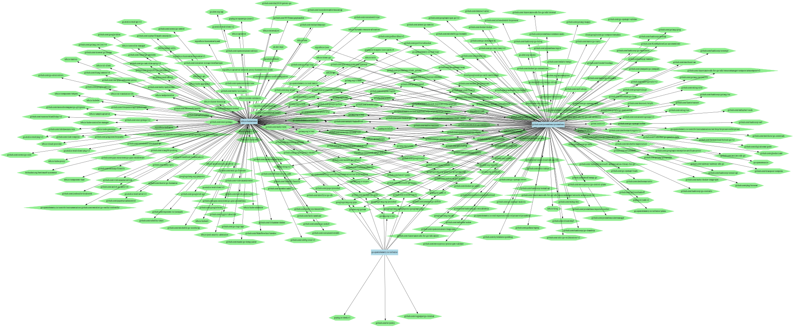

# dep-comparer

is the small util for developers and other people who needs to make list of dependecies from different files of package manager.

This tool work with Golang and go.mod at the moment.
I am going to add support different languages in the nearest future.

dev-comparer support:
- [x] Golang 
- [x] PHP
- [ ] JS/TS (in the nearest future)

### How it works?

The main idea show you "pivot" table of your dependencies across all your repositories.
This is useful when you just have started work by SSDLC and you find on the first step of SSDLC.

For example, you would like to get all packages and versions of your dependencies in Golang's go.mod, this look like something like that:
```bash
dep-comparer -l=golang testdata/go1.mod testdata/go2.mod testdata/go3.mod
```
The result of work will be report in csv format, for example [examples/report-1736365627.csv](examples/report-1736365627.csv)

### Experimental feature

If you look at the result of report generated by testdata go.mods, you will see a lot of dependencies. 
You will think about visualization and will be right.
dep-comparer support experimental feature - report in [dot-format](https://en.wikipedia.org/wiki/DOT_(graph_description_language)) and visualize in [graphviz](https://graphviz.org/Gallery/directed/)
If you want to get dot-report use `-dot` flag, for example:
```bash
dep-comparer -dot -l=golang testdata/go1.mod testdata/go2.mod testdata/go3.mod
```
or

```bash
dep-comparer -dot -l=php testdata/composer_laravel.json testdata/composer_symfony.json
```

This approach has dependency tool graphviz which you need to install in your environment.
After that you can use dor-report (csv-report is the default format).

For example:
```bash
sfdp -Gsize=67! -Goverlap=prism -Tsvg examples/graph_1736365627.dot > examples/root.svg
```

**IMPORTANT:** I am not professional in graphviz and visualization then you can use, modify and extend dot's report how you want :-)

